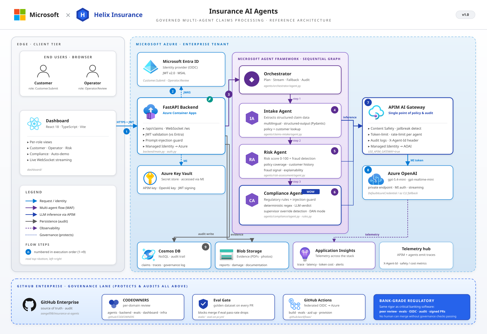

> **📐 Proposal.** A self-contained, standardized README following the AgentVerse
> [template](../templates/demo-scaffold/README-TEMPLATE.md), offered for the demo author
> to adopt — and adapt — as this demo's README.

---

# Insurance AI Agents

> Governed multi-agent claims processing: how an organization builds, governs and
> operates AI agents over a critical process with the same rigor demanded of
> enterprise software — packaged as a whitelabel, reskinnable demo.

**Contents:** [Part 1 · Business Brief](#part-1--business-brief) — present the demo ·
[Part 2 · Technical Brief](#part-2--technical-brief) — prepare and operate it

---

## Part 1 · Business Brief

### 1.1 At a glance

| | |
|---|---|
| **Scenario** | Insurance — auto claims processing (whitelabel: the same demo reskins to any regulated decision process) |
| **Business outcome** | Claims decided in minutes, with the control, traceability and auditability a regulator expects |
| **Best suited for** | Governance- and compliance-led conversations; regulated industries (insurance, banking, healthcare); rooms that include IT decision-makers or risk owners |
| **Duration** | 12–15 minutes |
| **Presenter effort** | Solo-friendly for the core flow; the governance sequence (step 4) benefits from a technical co-presenter or prepared screenshots |
| **Demo reliability** | High for the core flow — it runs entirely on built-in sample data |
| **Contingency** | If the live governance walkthrough is not practical, present a previously completed change request with its recorded approvals and quality report |

### 1.2 The story

A customer crashes their car and reports the claim. What happens next inside the insurer
is a chain of careful, regulated work: extract the facts, score the risk, check for
fraud, apply the regulatory rules, decide, and leave an audit trail a regulator can
replay. It is exactly the kind of critical process enterprises *want* to hand to AI
agents — and exactly the kind their IT and compliance departments will not allow without
control.

That tension is the story of this demo. It does not merely show three agents (Intake,
Risk, Compliance) processing a claim end-to-end, over web and real-time voice. It shows
the **operating model around them**: every AI call forced through a gateway that
enforces safety and spending policies, users properly authenticated, every decision
stored with its full reasoning for audit, agent behavior tested against a golden set of
claims before any change ships, and each agent's logic owned by the team accountable
for it.

The decisive scene: a regulator lowers a threshold, a developer changes one line of the
compliance rules, and the *governance machinery* — not a human promise — ensures the
compliance team must approve the change and the automated quality check must pass
before it ships. Agents governed like the critical software they are.

Why agents and not a rules engine? The judgment steps (understanding a free-text claim
report, weighing fraud signals) genuinely need AI. The demo's discipline is keeping the
AI *inside* a governed lane: rules stay in reviewable form, policies at the gateway, and
evidence in the audit trail.

### 1.3 The business case

| Business KPI | Without agents | Impact demonstrated |
|---|---|---|
| **Claims cycle time (report → decision)** | Days of sequential manual handling across intake, risk and compliance desks | A complete, reasoned decision streamed in minutes; visible live in the auto-demo |
| **Straight-through processing rate** | Low: most claims touch multiple humans regardless of complexity | Routine claims decided end-to-end by agents; only flagged cases reach the human review queue |
| **Cost per claim** | Proportional to manual touch time per desk | Human effort shifts from processing every claim to reviewing exceptions |
| **Fraud leakage** | Fraud signals reviewed inconsistently, under time pressure | Every claim receives a risk score and fraud probability, uniformly and auditable |
| **Regulatory change lead time** | Threshold changes travel through release cycles and manual test campaigns | A one-line rule change ships through a governed approval + automated quality check, applied without redeployment |
| **Audit readiness** | Evidence assembled retrospectively for each inspection | Every decision stored with its full reasoning trail; every AI call logged at the gateway |

The KPI that carries the investment decision in a regulated setting is not cycle time —
it is **regulatory change lead time and audit readiness**. Cost and speed benefits are
only realizable if compliance signs off, and the governance machinery is what makes that
signature possible.

### 1.4 Delivering the demo

#### Presenter verification (5 minutes before)

- [ ] The dashboard opens at the address provided by your technical contact and shows the branded home screen
- [ ] The **"Play auto demo"** button starts the four-stage claim walkthrough (run it once fully as a check)
- [ ] For the governance sequence: either the live change-request walkthrough is prepared, or you have the screenshots/recorded example at hand

#### Demonstration sequence

1. *(0–5 min)* Start **"Play auto demo"**. The four stages — Intake → Risk → Compliance
   → Decision — run as slides with the AI's output streaming live. Explain each agent's
   contribution as it completes: *"three specialists and a coordinator, doing in minutes
   what crosses three desks today."*
2. *(5–7 min)* Open the **Operator view**: the human review queue. *"The agents decide
   the routine cases; your people see only the exceptions — with the AI's full reasoning
   attached."*
3. *(7–9 min, technical rooms — shorten for business audiences)* Open the **Security
   view**: every AI call in the platform passed through a policy gateway that enforces
   content safety, spending limits and logging.
4. *(9–13 min)* The governance sequence: a regulator lowers a threshold. Show the
   one-line rule change and what the machinery does with it — the accountable team is
   automatically required to approve, and an automated quality check reports the impact
   on a set of reference claims before the change can ship. *"The system physically
   cannot ship a compliance change without the compliance team."*
5. *(13–15 min)* Close on the whitelabel proposition: the same application under a
   different brand in minutes — this is a template for *your* regulated process, not an
   insurance product.

#### Key moments

- The **rule-change approval**: governance enforced by machinery, not by promise — the
  control a bank demands of critical software, applied to AI.
- The **automated quality report** on the change, including a deliberate attack case
  (a fraudulent prompt hidden in a claim) that the system flags.
- **Voice**: the same claims pipeline operating over a real-time conversation.

### 1.5 Anticipated questions

**"Is our data used to train the AI models?"** — No. Azure OpenAI Service does not use
customer data to train the underlying models; data stays within the customer's tenant,
and in this design every AI call additionally passes through the customer's own gateway
where it is logged and policy-checked.

**"Who is accountable for an AI decision?"** — The same people as today. Regulatory
thresholds live in human-reviewable rules owned by the compliance team; flagged cases
route to the human review queue; and every decision is stored with its full reasoning
so it can be examined or appealed.

**"What about AI mistakes or manipulation?"** — Three layers: the gateway blocks unsafe
content and enforces limits; the reference-claims quality check catches behavioral
regressions before they ship (including a deliberate manipulation attempt in the test
set); and exceptions go to humans.

**"Is this only for insurance?"** — No. Claims are the example; the pattern is any
regulated decision process — lending, onboarding, benefits adjudication. The demo is
deliberately whitelabel to make that point.

**"What would this cost to run?"** — The demo itself runs on sample data at negligible
cost. Production economics depend on claim volume and model choice; the gateway's
spending limits and per-agent metering shown in the demo are precisely the tools used
to keep that predictable.

**"How long would a pilot take?"** — The honest framing: the technology is the fast
part; agreeing the governance (who owns which rules, what the quality bar is) is the
real work. A scoped pilot on one claim type, with the governance model agreed, is
typically a small number of months.

### 1.6 From demo to next step

Propose a **governance-focused workshop**: map one of the customer's regulated decision
processes onto this operating model — which team owns which rules, what the reference
dataset would contain, what the gateway policies should be. Output: a pilot scope for
one decision type with the governance model agreed up front.

### 1.7 What this demo is not

All claims are sample data; "Helix Insurance" is a fictional placeholder brand. The
regulatory thresholds and rules are illustrative, not a compliance product. The demo
shows the operating model; a real deployment starts from the customer's actual rules,
data protection assessment and identity setup.

### Glossary

- **AI agent** — a model given a role, instructions and tools, able to decide how to
  complete a task rather than following a fixed script.
- **AI gateway** — a control point all AI calls must pass through, enforcing safety
  policies, spending limits and logging (here: Azure API Management).
- **Audit trail** — the stored record of every decision with its inputs and reasoning,
  replayable for a regulator.
- **Golden dataset / quality check** — a fixed set of reference claims with expected
  outcomes; every change to the agents is automatically tested against it before it
  can ship.
- **Whitelabel** — the application is brand-neutral by design and reskins (name, logo,
  palette) in minutes.
- **Straight-through processing** — a claim handled end-to-end without human touch.

> *To prepare the environment for this demo, share Part 2 with your technical contact.*

---

## Part 2 · Technical Brief

### 2.1 Technical profile

| | |
|---|---|
| **Status** | Stable |
| **Orchestration** | Orchestrator–workers (MAF v1.4, with legacy-orchestrator fallback) |
| **Models** | gpt-5.4-mini · gpt-realtime-mini (voice) |
| **Azure services** | Azure AI Foundry · APIM (AI Gateway) · Cosmos DB · Container Apps · Static Web Apps · Entra ID |
| **Stack** | MAF · FastAPI + WebSocket · React 18 + TypeScript + Tailwind · Bicep |
| **Author** | @aangell98 |

### 2.2 The architecture

Reference architecture

In summary: Dashboard → Backend → Orchestrator → (Intake → Risk → Compliance), with
**every** model call routed through the APIM gateway, and results streamed back over
WebSocket while the audit trail lands in Cosmos DB.

#### Components

| Component | Where | Role |
|---|---|---|
| React dashboard | [dashboard/](dashboard/) | Whitelabel UI: auto-demo slides, customer / operator / policy / security views |
| Backend | [backend/main.py](backend/main.py) | FastAPI + WebSocket streaming; Entra ID JWT auth ([backend/auth.py](backend/auth.py)) |
| Orchestrator | [agents/orchestrator/](agents/orchestrator/) | MAF v1.4 coordination ([maf_agent.py](agents/orchestrator/maf_agent.py)) with a legacy fallback |
| AI Gateway | [infra/apim-policy.xml](infra/apim-policy.xml) | APIM policies: managed identity, content safety, token limits, token metrics, trace |
| Persistence | [backend/claims_repository.py](backend/claims_repository.py) | Cosmos DB with the complete audit trail of every decision |
| Voice channel | [agents/voice/](agents/voice/) | gpt-realtime-mini IVR over the *same* pipeline |
| Evals | [evals/](evals/) | Golden dataset + harness, wired into CI |
| Infra | [infra/main.bicep](infra/main.bicep) | APIM + Azure OpenAI + Cosmos + managed identity (Bicep, subscription scope) |

#### The agents

| Agent | Kind | Model | Job |
|---|---|---|---|
| `claims-intake` | LLM agent (+ content understanding) | gpt-5.4-mini | Structured extraction of the claim report into a typed schema |
| `risk-assessment` | LLM agent | gpt-5.4-mini | Risk scoring and fraud-probability estimation |
| `compliance` | LLM agent + code rules | gpt-5.4-mini | Applies regulatory rules ([rules.py](agents/compliance/rules.py)) to produce checks and a decision |
| `orchestrator` | LLM agent (MAF) | gpt-5.4-mini | Coordinates the three workers and the audit trail |

### 2.3 Agentic patterns

| Pattern | Where in this demo | Why it matters here | In business terms |
|---|---|---|---|
| **Orchestrator–workers** | [agents/orchestrator/maf_agent.py](agents/orchestrator/maf_agent.py) | Three specialized agents, one coordinator — each worker owns one competence and one team | A case manager delegating to three specialists |
| **AI Gateway (centralized policy enforcement)** | [infra/apim-policy.xml](infra/apim-policy.xml) | No agent talks to the model directly; safety, quotas, metrics and audit enforced in one place, keyless via managed identity | Every AI call goes through one controlled checkpoint |
| **Eval gate in CI** | [evals/run_evals.py](evals/run_evals.py) + `.github/workflows/eval-on-pr.yml` | Agent behavior regression-tested like code: golden claims (incl. a prompt-injection case) gate every merge | Every change to the agents must pass an automated exam before it ships |
| **Governance-as-code** | `.github/CODEOWNERS` | A change to compliance logic cannot merge without the compliance team | The org chart is enforced by the system, not by convention |
| **Rules in code, judgment in the model** | [agents/compliance/rules.py](agents/compliance/rules.py) | Regulatory thresholds stay in reviewable, diffable Python; the LLM never owns the rulebook | The AI reasons; the rulebook stays human-owned and inspectable |
| **Multichannel, one pipeline** | [agents/voice/](agents/voice/) | Web and real-time voice reuse the same agents | The phone channel and the web channel are the same brain |
| **Audited persistence** | [backend/claims_repository.py](backend/claims_repository.py) | Every decision replayable for a regulator (Cosmos DB audit trail) | Every decision keeps its receipts |

### 2.4 Technical setup

Run the day before a session; the end state is what §1.4's presenter verification
checks.

- [ ] Backend: venv, `pip install -r backend/requirements.txt`, then `uvicorn main:app --port 8000` from `backend/`
- [ ] Dashboard: `npm install && npm run dev` in `dashboard/` → http://localhost:5173
- [ ] Run the auto demo once end-to-end
- [ ] Governance sequence (live variant): repository access with a prepared branch editing `HIGH_AMOUNT_THRESHOLD` in [agents/compliance/rules.py](agents/compliance/rules.py); confirm the eval workflow runs on the PR. Alternative: capture screenshots of a merged PR with the eval-gate comment and CODEOWNERS review
- [ ] Full Azure deployment (for the gateway/security view with live data): `.\scripts\deploy.ps1 -ResourceGroup <rg> -Location <region>`

### 2.5 Additional resources

#### Whitelabel / reskinning

The default "Helix Insurance" brand is a placeholder. Palette, logo and name change via
`brand.ts` — see [BRANDING.md](BRANDING.md). One-command redeploy with a different
brand: `.\scripts\deploy.ps1 -BrandName "Your Brand"`. The `santander` branch is a
complete second-brand example.

#### One-command Azure deployment

`.\scripts\deploy.ps1` provisions the Bicep infra, builds the backend into ACR →
Container Apps, and publishes the dashboard to Static Web Apps; when it finishes it
prints the app and API URLs.

#### Also in the repository

- [agents/hosted/](agents/hosted/) — the agent variant hosted in Azure AI Foundry.
- [agents/content_understanding/](agents/content_understanding/) — schema-based document
  extraction feeding intake.
- [evals/README.md](evals/README.md) — how the golden dataset and harness work.
- Identity: Entra ID (MSAL) for users, federated OIDC for CI/CD.
- Catalog manifest: [agentverse.yaml](agentverse.yaml). License: MIT.
