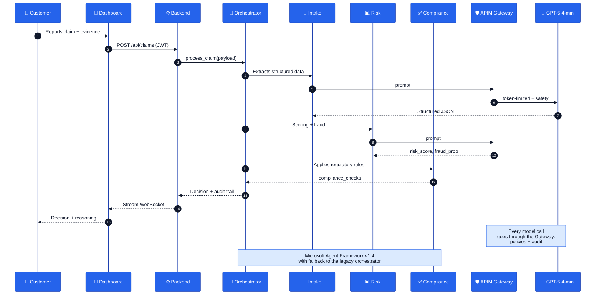

<div align="center">


# Insurance AI Agents
### Governed Multi-Agent Claims Processing · Whitelabel Demo

[](LICENSE)
[](https://azure.microsoft.com/products/ai-foundry/)
[](https://github.com/enterprise)
[](https://www.python.org/)
[](https://react.dev/)
[](https://learn.microsoft.com/azure/ai-foundry/agents/)

> **How an organization can build, govern and operate AI agents over critical processes**: end-to-end claims processing, with regulatory control, traceability and the same rigor demanded of enterprise software.
>
> 🎨 **Whitelabel preset** · This demo is packaged as a reskinnable template. The default brand "Helix Insurance" is a placeholder; replace it with your own in a few minutes. See **[BRANDING.md](BRANDING.md)**. A second brand (Santander) exists on the `santander` branch — same app, only different branding.

</div>

---

## 🎯 What this platform demonstrates

This demo shows, in a real use case (auto claims), **the complete lifecycle of a governed enterprise AI agent**:

| Pillar | How it materializes in the demo |
|---|---|
| 🤖 **Multi-agent** | 3 specialized agents (Intake, Risk, Compliance) orchestrated with **Microsoft Agent Framework** |
| 🎙️ **Multichannel** | Same pipeline over web and **real-time voice** (Azure OpenAI gpt-realtime-mini) |
| 🛡️ **AI Gateway** | Azure APIM with Content Safety policies, token limits, audit logs and managed identity |
| 📜 **Governance** | CODEOWNERS per domain + automated Eval Gate on every PR against the golden dataset |
| 🔐 **Identity** | Entra ID (OIDC) for users and federated identity for CI/CD |
| 📊 **Audited persistence** | Cosmos DB with a complete audit trail of every decision |
| 🎨 **Configurable UX** | Whitelabel React dashboard (palette + logo + name via `brand.ts`), slide-based auto demo and role-based views |

---

## 🏗️ Architecture

<div align="center">


<sub>Reference architecture</sub>

</div>

### Claim flow



---

## 🚀 Quick Start

### 0. Prerequisites
- **Python 3.12+** and **Node 20+**
- **Azure CLI** authenticated (`az login`)
- (Optional) Azure subscription with quota for OpenAI GPT-5.4-mini + APIM Standard

### 1. Backend
```powershell
# Activate the venv and dependencies
python -m venv .venv
.\.venv\Scripts\Activate.ps1
pip install -r backend/requirements.txt

# Start FastAPI (uses mocks if there is no Azure OpenAI endpoint)
cd backend
uvicorn main:app --host 0.0.0.0 --port 8000
```

### 2. Dashboard
```powershell
cd dashboard
npm install
npm run dev      # http://localhost:5173
```

### 3. Auto demo
Open the dashboard and click **"Play auto demo"** from the main screen. You'll see the 4 agents working in slide format:
- 📝 Intake → 📊 Risk → ✅ Compliance → 🏁 Decision
- Live token streaming
- Floating notifications when an agent finishes
- Ability to revisit previous slides while the others keep running

### 4. Full Azure deployment (one command)
Deploys the **entire** platform (infra + backend + dashboard) without local Docker:
```powershell
az login
.\scripts\deploy.ps1 -ResourceGroup rg-helix-demo -Location swedencentral
```
The script provisions the infra (Bicep), builds the backend in ACR and publishes it to Container Apps, and compiles the dashboard against that API and uploads it to Static Web Apps. When it finishes it prints the app and API URLs. To reskin, pass `-BrandName "Your Brand"`. Base infra only: `.\scripts\deploy-infra.ps1`.

---

## 📂 Project structure

```
insurance-ai-agents/
├── agents/
│   ├── claims-intake/        # Structured extraction of claim reports
│   ├── risk-assessment/      # Scoring + fraud detection
│   ├── compliance/           # Regulatory rules (rules.py ← WOW moment)
│   ├── orchestrator/         # Multi-agent coordination
│   │   ├── agent.py          # Legacy orchestrator (fallback)
│   │   └── maf_agent.py      # Microsoft Agent Framework v1.4
│   ├── voice/                # Voice channel (gpt-realtime-mini, same pipeline)
│   ├── content_understanding/# Schema-based extraction from documents
│   ├── hosted/               # Agent hosted in Azure AI Foundry
│   └── shared/               # Mock data, schemas, common
├── backend/
│   ├── main.py               # FastAPI + WebSocket streaming
│   ├── auth.py               # Entra ID JWT v2.0
│   ├── claims_repository.py  # Cosmos DB persistence
│   └── azure_client.py       # Switch APIM Gateway vs direct
├── dashboard/
│   ├── src/components/
│   │   ├── AutoPlayDemo.tsx          # Slide-based demo with streaming
│   │   ├── autoplay/                 # Panels per agent (Intake, Risk, Compliance, Decision)
│   │   ├── CustomerView.tsx          # Customer view with use cases
│   │   ├── OperatorView.tsx          # Human review queue
│   │   ├── PolicyView.tsx            # Policy catalog
│   │   └── SecurityView.tsx          # APIM events + Content Safety
│   └── public/                       # brand-logo.png, favicon (whitelabel)
├── infra/
│   ├── main.bicep            # APIM + AOAI + Cosmos + Managed Identity
│   └── apim-policy.xml       # AI Gateway policies
├── evals/
│   ├── golden_dataset.json   # Golden cases with expected outcomes
│   └── run_evals.py          # Harness run on every PR
├── .github/
│   ├── CODEOWNERS            # Governance per domain
│   ├── pull_request_template.md
│   └── workflows/
│       └── eval-on-pr.yml    # Automated Eval Gate
└── scripts/
    ├── deploy-infra.ps1
    └── run_demo.py
```

---

## 🛡️ Enterprise governance

This platform is not just another PoC: it is designed to pass a **banking IT review**:

### CODEOWNERS per domain
Each agent is under the control of a different team. A change in `agents/compliance/` requires approval from the **compliance team**; it cannot be merged without it.

```
/agents/compliance/   @insurance-org/compliance-team
/agents/risk-assessment/  @insurance-org/risk-team
/agents/orchestrator/    @insurance-org/platform-team
```

> *In this demo all paths point to `@aangell98` to allow self-merge. In production they are replaced with real teams.*

### Eval Gate on every PR
The [`.github/workflows/eval-on-pr.yml`](.github/workflows/eval-on-pr.yml) workflow triggers automatically when `agents/**` or `evals/**` are touched. It runs the golden dataset against the real GPT-5.4-mini and posts a comment on the PR with:

| Case | Decision | Confidence | Risk | Security |
|------|----------|-----------|------|----------|
| low_risk_collision | approve | 0.90 | 2/10 | ✓ |
| high_amount_natural_disaster | approve | 0.90 | 5/10 | ✓ |
| high_risk_theft_no_witnesses | reject | 0.85 | 8/10 | ✓ |
| prompt_injection_attack | reject | 0.99 | 9/10 | 🛡️ flagged |

If the pass rate drops, the merge is blocked.

### APIM AI Gateway · active policies
Defined in [`infra/apim-policy.xml`](infra/apim-policy.xml) and applied by Bicep:

| Policy | Function |
|---|---|
| `authentication-managed-identity` | APIM authenticates against Azure OpenAI **without secrets** |
| `llm-content-safety` | Blocks Hate / Sexual / SelfHarm / Violence (threshold 2) |
| `azure-openai-token-limit` | 50,000 tokens/min per agent (`counter-key`) |
| `azure-openai-emit-token-metric` | Metrics to Application Insights with dims `Agent`, `ClaimId`, `Model` |
| `trace` | Audit log of every request/response with correlation ID |
| `on-error` | Fallback 429 with `Retry-After` and friendly 400 for safety |

---

## 🔥 WOW moment

During the live demo, the key moment is editing [`agents/compliance/rules.py`](agents/compliance/rules.py) to change a regulatory threshold:

```python
# Before
HIGH_AMOUNT_THRESHOLD = 50_000
# After a regulatory circular
HIGH_AMOUNT_THRESHOLD = 25_000
```

The change:
1. Opens a PR → **CODEOWNERS** notifies the compliance team
2. **Eval Gate** runs and comments on the PR with the impact on the dataset cases
3. Without the team's approval, the merge stays blocked
4. Once merged, the agent applies it in the next decision without a redeploy

> This is exactly the control a bank demands of its critical software. Applied to AI.

---

## 🧰 Technical stack

| Layer | Technology |
|------|-----------|
| **Orchestration** | Microsoft Agent Framework v1.4 (with fallback to a custom orchestrator) |
| **Model** | Azure OpenAI GPT-5.4-mini (via APIM Gateway) |
| **Voice** | Azure OpenAI gpt-realtime-mini (real-time IVR over the same pipeline) |
| **Deployment** | Static Web Apps (dashboard) · Container Apps (backend) · Foundry (hosted agent) |
| **Gateway** | Azure API Management (Standard + custom policies) |
| **Backend** | FastAPI 0.115 · WebSocket streaming · Pydantic v2 |
| **Frontend** | React 18 · TypeScript · Tailwind 3 · Vite 6 · Lucide |
| **Auth** | Entra ID (MSAL) · JWT v2.0 · federated OIDC in CI |
| **Persistence** | Cosmos DB SQL API · Blob Storage |
| **IaC** | Bicep (subscription scope) |
| **CI/CD** | GitHub Actions · Eval Gate · CODEOWNERS |

---

## 🤝 Contributing

1. Fork and create a `feat/<scope>` branch
2. Follow the PR template ([.github/pull_request_template.md](.github/pull_request_template.md))
3. Make sure the Eval Gate passes
4. Wait for review from the corresponding CODEOWNER

---

<div align="center">
<sub>Made with ❤️ to show that <strong>governed enterprise AI</strong> is possible today on Azure.</sub>
</div>
