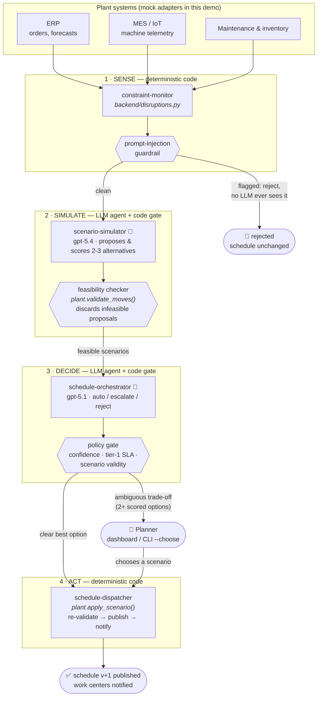

> **📐 Proposal.** A self-contained, standardized README following the AgentVerse
> [template](../templates/demo-scaffold/README-TEMPLATE.md), offered for the demo author
> to adopt — and adapt — as this demo's README.

---

# Production Scheduling AI Agents

> Constraint-aware, self-healing production scheduling: an agentic control loop on top
> of existing ERP/MES systems that works like an experienced planner who never sleeps.

**Contents:** [Part 1 · Business Brief](#part-1--business-brief) — present the demo ·
[Part 2 · Technical Brief](#part-2--technical-brief) — prepare and operate it

---

## Part 1 · Business Brief

### 1.1 At a glance

| | |
|---|---|
| **Scenario** | Manufacturing — keeping the production schedule correct all day, not just at the overnight optimization |
| **Business outcome** | Disruptions resolved in minutes instead of hours, measured live on a KPI dashboard |
| **Best suited for** | Manufacturing / operations leaders evaluating agentic AI beyond chat; plant, supply-chain and OT audiences |
| **Duration** | 10–12 minutes |
| **Presenter effort** | **Low — the most solo-friendly demo in this catalog.** Replay mode behaves identically every run |
| **Demo reliability** | Very high — the default mode has no cloud dependency at all; nothing external can fail mid-session |
| **Contingency** | Replay mode *is* the contingency; keep to the four scripted disruptions and every run is deterministic |

### 1.2 The story

A production schedule is only correct at the moment it is generated. Plants optimize it
overnight, and by mid-morning reality has drifted: a machine goes down, a material
shipment slips, a priority order lands mid-shift. Re-planning is slow and manual — a
planner must notice the disruption, work out which orders it touches, mentally simulate
alternatives, and push changes back into the plant systems. That cycle takes hours, and
every hour shows up as idle lines, expedite fees and late deliveries. Skilled planners
end up as firefighters.

The root cause is architectural, not effort: batch optimizers answer *"what is the best
plan given a frozen snapshot?"*, while a factory needs *"what should we do **now**, given
what just changed?"* — continuously.

This demo treats scheduling as a continuous **Sense → Simulate → Decide → Act** loop run
by agents layered on top of the systems the plant already owns. A monitor classifies
disruptions by which constraints they threaten; a simulator agent proposes and scores
alternative schedules; a decision agent applies the best option autonomously when the
answer is clear — and escalates to the human planner *only* when the trade-off is
genuinely ambiguous, always with scored options and a plain-language rationale. A
dispatcher publishes the validated schedule back and notifies the work centers.

Why agents? Because the middle of that loop — weighing changeover cost against urgency,
labor balance, energy windows, a priority customer against three standard orders — is
judgment. And the demo's sharpest design decision is where agents are **not**: sensing
and acting stay conventional software, and safety-critical constraints are checked by a
deterministic validator, so no schedule violating safety or capacity can ever be
published, regardless of what the AI proposes.

### 1.3 The business case

This demo has an unusual advantage: its KPIs are not claimed on a slide — they are
computed live on the dashboard's KPI strip and move as disruptions are resolved.

| Business KPI | Without agents | Impact demonstrated |
|---|---|---|
| **Time-to-adjust per disruption** | Hours: detection → analysis → decision → systems update, all manual | Minutes: the full loop closes automatically; measured live on the KPI strip |
| **Line idle time** | Accumulates while the broken schedule stays in force | Reduced directly by faster reflows; visible after each disruption |
| **Schedule adherence** | Degrades through the shift as reality drifts from the overnight plan | Maintained by continuous adjustment; tracked live |
| **Planner interventions per shift** | Every disruption demands planner attention — planners as firefighters | Only genuinely ambiguous trade-offs escalate; the count is measured on the strip |
| **On-time delivery to priority customers** | Priority commitments compete unmanaged with routine orders during firefighting | Priority-customer protection is an explicit, enforced rule and a scored dimension in every alternative |
| **Expedite and changeover costs** | Incurred reactively once the schedule has already collapsed | Changeover cost and downstream congestion are scored trade-offs in every proposed alternative |

The economic argument rests on **time-to-adjust**: every other KPI on the strip — idle
time, adherence, expedite fees — is a downstream function of how long a broken schedule
stays in force. The secondary argument is workforce leverage: planners recover the
capacity, demand and improvement work they were hired for.

### 1.4 Delivering the demo

#### Presenter verification (5 minutes before)

- [ ] The dashboard opens at the address provided by your technical contact and shows the schedule as a Gantt board with all orders on plan (green)
- [ ] The three disruption buttons are visible (machine down · material delay · rush order)
- [ ] You know which disruptions to use: the four scripted ones are guaranteed to behave identically every run

#### Demonstration sequence

1. *(0–2 min)* Open the dashboard: today's schedule as a Gantt board, all orders on
   plan. *"This plan was optimized overnight — and it is about to meet reality."*
2. *(2–5 min)* Inject **machine down**. Follow the agent feed: the monitor classifies
   the event, the simulator proposes two or three scored alternatives, the infeasible
   ones are discarded by the validator, and the decision agent applies the best one
   **autonomously**. The Gantt board reflows and the KPI strip updates. *"Hours of
   re-planning, closed in minutes — and measured, not claimed."*
3. *(5–8 min)* Inject **material delay** — a genuinely ambiguous case. It arrives in the
   **escalation inbox** with scored options and a plain-language rationale; choose one
   as the planner. *"The system absorbed the routine case and escalated the judgment
   call — with evidence, not an alarm."*
4. *(8–10 min)* Inject **prompt injection**: a malicious instruction hidden in a
   free-text field from the plant systems. The guardrail rejects it — the schedule is
   unchanged and **the AI was never even invoked**. *"Security enforced before the
   model, not after it."*
5. *(10–12 min)* Close on the **KPI strip**: time-to-adjust, idle time, adherence,
   interventions per shift. *(Optional, technical rooms: show the automated quality
   check — the set of reference disruptions every change to these agents must pass.)*

#### Key moments

- The **Gantt reflow** seconds after a disruption — the hours of manual re-planning,
  eliminated and measured on screen.
- The **escalation inbox**: autonomy with accountability — scored options and a
  rationale, not a raw alarm.
- The **injection rejection**: the malicious input never reaches the AI at all.

### 1.5 Anticipated questions

**"Does this replace our ERP / planning system?"** — No. It layers on top of the
systems the plant already owns and coordinates them; the overnight optimizer still
produces the base plan. This loop keeps that plan correct between optimizations.

**"What if the AI proposes something unsafe or impossible?"** — It cannot ship. Every
proposed schedule is validated by a deterministic checker against the hard constraints
(capacity, tool compatibility, process dependencies, safety, materials) before
publication — and validated again at dispatch. The AI reasons about trade-offs; the
rulebook is enforced by conventional software.

**"Is our data used to train the AI models?"** — No. Azure OpenAI Service does not use
customer data to train the underlying models; in this demo's default mode, no data
leaves the machine at all.

**"What data would this need from us?"** — Orders and priorities (ERP), machine and
line telemetry (MES/IoT), and maintenance/inventory calendars. The demo runs these as
built-in mock feeds; a pilot starts by mapping the real ones.

**"How long would a pilot take?"** — The honest framing: the loop itself is built; the
work is connecting feeds and encoding *your* constraints and escalation policy. A
replay-style pilot against historical disruptions — no plant connection, no risk — is
the natural first step and is measured in weeks.

### 1.6 From demo to next step

Propose a **shop-floor discovery workshop**: inventory the customer's actual disruption
types, hard and soft constraints, and today's time-to-adjust. Then a **replay pilot**:
run the loop against a set of the customer's historical disruptions and compare the
agent's proposals with what the planners actually did — value demonstrated with zero
connection to live plant systems.

### 1.7 What this demo is not

The plant, its orders and its telemetry are simulated, and the default presentation
mode replays pre-recorded agent responses for reliability. The live cloud path is
implemented but marked experimental. This is a demonstration of the operating pattern,
not a scheduling product — a real deployment starts from the customer's constraint
model and systems landscape.

### Glossary

- **AI agent** — a model given a role, instructions and tools, able to decide how to
  complete a task rather than following a fixed script.
- **ERP / MES** — the plant's business system (orders, materials) and manufacturing
  execution system (what is actually happening on the lines).
- **Hard vs. soft constraints** — rules that can never be broken (safety, machine
  capability) vs. preferences to optimize (changeover time, labor balance).
- **Escalation** — the system handing an ambiguous decision to the human planner, with
  scored options and a rationale.
- **Replay mode** — the demo re-plays previously recorded AI responses, making every
  run identical and independent of any cloud service.
- **Gantt board** — the schedule visualized as bars per machine over time.

> *To prepare the environment for this demo, share Part 2 with your technical contact.*

---

## Part 2 · Technical Brief

### 2.1 Technical profile

| | |
|---|---|
| **Status** | Experimental (fully implemented; live Foundry path pending its first real-subscription run) |
| **Orchestration** | Orchestrator–workers + human-in-the-loop escalation ([PATTERNS.md](../templates/agentic-framework/PATTERNS.md) §5, §8) |
| **Models** | gpt-5.4 (simulator) · gpt-5.1 (orchestrator) |
| **Azure services** | Azure AI Foundry · Application Insights · App Service (Terraform) |
| **Stack** | MAF · FastAPI + SSE · vanilla HTML/JS (Gantt dashboard) · Terraform |
| **Runs locally without Azure?** | **Yes — by default.** Replay mode uses recorded agent fixtures; zero Azure dependencies, all 4 golden evals pass |
| **Author** | — |

### 2.2 The architecture

The control loop:

#### Components

| Component | Where | Role |
|---|---|---|
| Pipeline | [backend/pipeline.py](backend/pipeline.py) | Wires the four stages into one run per disruption |
| Plant model + feasibility checker | [backend/plant.py](backend/plant.py) | Deterministic validation of every proposed move; applies chosen scenarios |
| Disruption classifier + guardrail | [backend/disruptions.py](backend/disruptions.py) | Hard/soft constraint classification; injection screen on free text from MES/ERP |
| LLM agents | [agents/scenario-simulator/](agents/scenario-simulator/), [agents/schedule-orchestrator/](agents/schedule-orchestrator/) | Each a folder of `agent.yaml` · `instructions.md` · `schemas.py` · `agent.py` |
| Replay fixtures | [agents/fixtures/](agents/fixtures/) | Recorded agent responses — the zero-Azure demo mode |
| Dashboard | [frontend/](frontend/) served by [backend/main.py](backend/main.py) | Gantt board, live agent feed, escalation inbox, KPI strip |
| CLI runner | [scripts/run_demo.py](scripts/run_demo.py) | Same pipeline without a browser; `--record` refreshes fixtures |
| Evals | [evals/](evals/) | Golden disruption scenarios gate every change |
| Infra | [infra/](infra/) | Terraform provisions Foundry + models + App Insights + App Service *and* ships the app code in one apply |

#### The agents

| Agent | Kind | Model | Job |
|---|---|---|---|
| `constraint-monitor` | ⚙️ deterministic code | — | Classify feed events against hard/soft constraints; injection guardrail |
| `scenario-simulator` | 🤖 LLM agent | gpt-5.4 | Generate & score 2–3 alternative schedules; every proposal re-validated deterministically |
| `schedule-orchestrator` | 🤖 LLM agent | gpt-5.1 | Auto-apply vs. escalate vs. reject; a code policy gate enforces the rules |
| `schedule-dispatcher` | ⚙️ deterministic code | — | Re-validate (last line of defense), publish, notify work centers |

### 2.3 Agentic patterns

| Pattern | Where in this demo | Why it matters here | In business terms |
|---|---|---|---|
| **Orchestrator–workers** | [backend/pipeline.py](backend/pipeline.py) chaining simulator → orchestrator | Judgment split across specialized agents with structured hand-offs | An analyst proposes options; a decision-maker picks or escalates |
| **Human-in-the-loop escalation** | Policy gate → planner dashboard / `--choose` | Autonomy when clear, humans only for genuinely ambiguous trade-offs | The system asks for help only when the call deserves human judgment |
| **Deterministic guardrails around LLMs** | [backend/plant.py](backend/plant.py) `validate_moves()` + policy gate | LLMs reason and explain; hard constraints are enforced by code, so an infeasible schedule can never ship | The AI suggests; a rulebook it cannot override does the final check |
| **Prompt-injection defense** | [backend/disruptions.py](backend/disruptions.py) | Malicious free text from ERP/MES is rejected *before any LLM sees it* | Suspicious input is stopped at the door, not argued with |
| **Eval gate** | [evals/run_evals.py](evals/run_evals.py) + [.github/workflows](.github/workflows/) | Golden disruption cases (incl. the injection case) gate every PR | Every change to the agents must pass an automated exam before it ships |
| **Replay / record fixtures** | [agents/fixtures/](agents/fixtures/), `--record` | Deterministic, zero-Azure, zero-latency demonstrations | The demo is rehearsable and cannot fail on stage |
| **Observability as product** | KPI strip ([backend/kpis.py](backend/kpis.py)) + tracing/token metrics | Idle time, adherence, interventions/shift, time-to-adjust measured live | The business impact is on a scoreboard, not in a slide |

### 2.4 Technical setup

Run the day before a session; the end state is what §1.4's presenter verification
checks. Full walkthrough: [GETTING_STARTED.md](GETTING_STARTED.md).

- [ ] Replay mode (recommended for presentations): venv + `pip install pydantic pyyaml fastapi "uvicorn[standard]"` — nothing else needed
- [ ] Dashboard: `python -m uvicorn backend.main:app --port 8000` → http://localhost:8000
- [ ] Verify each scripted disruption once: `python scripts/run_demo.py --disruption machine_down` (also `material_delay`, `rush_order`, `prompt_injection`)
- [ ] Optional eval display for technical rooms: `python -m evals.run_evals`
- [ ] Live mode (optional): `pip install -r requirements.txt`; `cd infra && terraform apply`; `.env` from `terraform output`; `az login`. Replay note: only the four scripted disruptions have fixtures — record new ones with `--record`
- [ ] Windows ARM64: install the `windows_amd64` Terraform build (azurerm ships no ARM64 Windows binaries)

### 2.5 Additional resources

#### One-apply cloud deploy

`cd infra && terraform apply` provisions Foundry, model deployments, App Insights and
App Service **and ships the app code** (zip deploy) in a single apply;
`terraform output demo_url` opens it.

#### Also in the repository

- Full demo-repo governance: [.github/](.github/) CODEOWNERS, PR template, eval workflow,
  plus [CHANGELOG.md](CHANGELOG.md), [CONTRIBUTING.md](CONTRIBUTING.md), [LICENSE](LICENSE) (MIT).
- Per-folder READMEs in [agents/](agents/README.md), [backend/](backend/README.md),
  [frontend/](frontend/README.md), [evals/](evals/README.md), [infra/](infra/README.md),
  [scripts/](scripts/README.md).
- Catalog manifest: [agentverse.yaml](agentverse.yaml).
