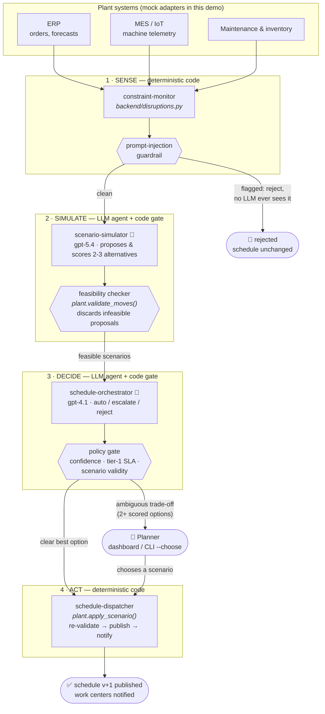
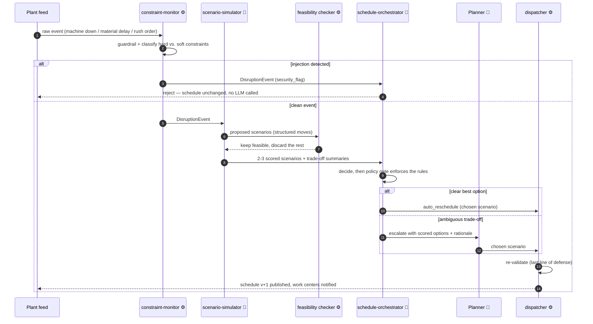

# Production Scheduling AI Agents
### Constraint-aware, self-healing production scheduling for manufacturing plants

[](LICENSE)
[](https://azure.microsoft.com/products/ai-foundry/)
[](https://www.python.org/)
[](agentverse.yaml)

> Traditional production schedules are optimized overnight and collapse by mid-morning:
> machines go down, materials slip, priority orders land. This demo shows an **agentic
> orchestration layer** on top of existing ERP/MES systems that works like *an experienced
> production planner who never sleeps* — it continuously monitors constraints, simulates
> alternatives, autonomously adjusts the schedule, and escalates only genuinely ambiguous
> decisions to a human planner. Aimed at manufacturing / operations audiences evaluating
> agentic AI beyond chat.

> **🟢 Status: fully implemented.** The Sense → Simulate → Decide → Act loop, the web
> dashboard (Gantt board + agent feed + escalation inbox), the CLI runner, the eval gate,
> and the Terraform-driven cloud deploy are all built. Runs in **replay mode with zero
> Azure dependencies** by default; all 4 golden eval cases pass. Live Foundry path and
> first `terraform apply` are pending their first real-subscription run.
> **New here? Follow [GETTING_STARTED.md](GETTING_STARTED.md)** — from nothing to full
> deployment, step by step.

---

## Why this is needed

A production schedule is only correct at the moment it is generated. Plants typically
optimize it overnight with an ERP or APS run, and then reality drifts away from it all
day long:

- **Constraints change constantly.** Machines break or slow down, material shipments
  slip, operators call in sick, a priority customer order lands mid-shift. A static plan
  has no answer for any of this.
- **Re-planning is slow and manual.** When a disruption hits, a planner has to notice it,
  understand which orders it touches, mentally simulate the alternatives, and push
  changes back into ERP/MES. That detection → decision → adjustment cycle takes hours,
  and by the time it finishes the plant has often drifted again.
- **Planners become firefighters.** Skilled people spend their day re-sequencing jobs and
  chasing exceptions instead of doing the capacity, demand, and improvement work they
  were hired for.
- **The cost is real and compounding.** Every hour a schedule stays broken shows up as
  line idle time, missed changeover windows, expedite fees, and late deliveries to the
  customers who matter most.

The root cause is architectural, not effort: batch optimizers answer *"what is the best
plan given a frozen snapshot?"*, while a factory needs an answer to *"what should we do
**now**, given what just changed?"* — continuously.

## How this solution solves it

The demo treats scheduling as a **continuous, adaptive control loop** run by AI agents,
layered on top of the systems the plant already owns (it enhances ERP/MES coordination,
it does not replace those platforms):

1. **Sense** — `constraint-monitor` watches machine telemetry, material flow, and
   maintenance calendars in real time, and turns raw signals into classified disruption
   events: which orders are hit, and which **hard** constraints (capacity, tool
   compatibility, process dependencies, safety, materials) vs. **soft** constraints
   (sequencing preferences, changeovers, labor balance, customer tiers, energy) are at
   stake.
2. **Simulate** — `scenario-simulator` generates alternative schedules the moment a
   disruption lands, validates each against a deterministic constraint solver, and scores
   the feasible ones on the trade-offs a planner weighs: changeover cost vs. urgency,
   labor balance, energy windows, downstream congestion.
3. **Decide** — `schedule-orchestrator` applies the best option **autonomously when the
   answer is clear**, and escalates to the human planner only when the trade-off is
   genuinely ambiguous (e.g. a tier-1 SLA vs. three standard orders) — always with scored
   options and a plain-language rationale, never a raw alarm.
4. **Act** — `schedule-dispatcher` publishes the validated schedule back through ERP/MES
   and notifies the affected work centers with the what and the why, so the shop floor
   can trust (and audit) every reflow.

This closes the loop in **minutes instead of hours**, and it inverts the planner's role:
the agents absorb the routine re-sequencing, the human handles only the decisions that
deserve judgment. The KPI strip on the dashboard makes the impact measurable live —
**line idle time**, **schedule adherence**, **planner interventions per shift**, and
**time-to-adjust per disruption** — and the deeper win it dramatizes is stability:
schedules that stop collapsing multiple times per day.

## What it demonstrates

| Pillar | How it shows up here |
|---|---|
| 🤖 Multi-agent | 4 agents in an **orchestrator–workers** workflow with Microsoft Agent Framework |
| 🏭 Constraint reasoning | Hard constraints (machine capacity, tool compatibility, process dependencies, safety, material availability) vs. soft constraints (sequencing preferences, changeover minimization, labor balancing, customer tiers, energy windows) |
| 👤 Human-in-the-loop | The orchestrator escalates only ambiguous trade-offs to the planner dashboard for approval |
| 🛡️ Guardrails | Hard constraints are enforced deterministically (never by the LLM alone); prompt-injection defense on free-text fields from MES/ERP |
| 📊 Observability | Tracing + token metrics for every scheduling decision |
| ✅ Evals | Golden disruption scenarios gate every change |

## Architecture

### Total workflow — the control loop



### One disruption, end to end



- **Orchestration pattern:** orchestrator–workers, with a human-in-the-loop escalation
  branch (see [PATTERNS.md](../templates/agentic-framework/PATTERNS.md) §5 and §8)
- **Agents:** constraint-monitor → schedule-orchestrator → { scenario-simulator ⇄
  orchestrator } → schedule-dispatcher (or planner approval first)
- **Key design rule:** the LLM agents *reason about trade-offs and explain decisions*;
  **hard constraints are validated deterministically** (constraint-solver tool +
  guardrails), so no schedule violating safety or capacity can ever be published.

### The agents

| Role | Kind | Job |
|---|---|---|
| [`constraint-monitor`](agents/constraint-monitor/) | ⚙️ deterministic code | Classify raw feed events against hard/soft constraints; injection guardrail on free text ([backend/disruptions.py](backend/disruptions.py)) |
| [`scenario-simulator`](agents/scenario-simulator/) | ✅ LLM agent (gpt-5.4 reasoning) | Generate & score alternative schedules; every proposal re-validated by the deterministic feasibility checker |
| [`schedule-orchestrator`](agents/schedule-orchestrator/) | ✅ LLM agent (gpt-4.1) | Decide autonomous adjustment vs. planner escalation; a code policy gate enforces the rules |
| [`schedule-dispatcher`](agents/schedule-dispatcher/) | ⚙️ deterministic code | Re-validate and apply the chosen scenario; notify work centers ([backend/plant.py](backend/plant.py)) |

The LLM agents sit exactly where judgment lives; sensing and acting stay
deterministic on purpose — no unvalidated schedule can ever be published.

### Demo storyline (planned)

1. The dashboard shows today's schedule as a Gantt board — everything green.
2. You inject a disruption (a button per scenario): *machine down*, *material delay*,
   *rush order*.
3. `constraint-monitor` classifies it; `scenario-simulator` produces 2–3 scored options;
   the orchestrator picks one autonomously **or** escalates it to you as the planner.
4. On approval, `schedule-dispatcher` publishes the new schedule; the Gantt board reflows
   live, and the KPI strip (idle time, adherence, interventions) updates.

---

## Prerequisites

- Python 3.12+ and Node 20+ (React dashboard)
- Azure CLI ≥ 2.60 (`az login`)
- An Azure subscription with quota for gpt-4.1 and a gpt-5.x reasoning model in eastus2
  (or your region)

> This demo will fall back to **mock ERP/MES data** when no Azure endpoint is configured,
> so you can explore the scheduling flow without Azure.

---

## Quick Start

> Full walkthrough with explanations: **[GETTING_STARTED.md](GETTING_STARTED.md)**.

### Run it right now — no Azure, no config

```bash
python -m venv .venv
. .venv/bin/activate                 # PowerShell: .venv\Scripts\Activate.ps1
pip install pydantic pyyaml          # the only deps replay mode needs

python scripts/run_demo.py --disruption machine_down                 # autonomy
python scripts/run_demo.py --disruption material_delay --choose SCN-A  # human-in-the-loop
python scripts/run_demo.py --disruption prompt_injection             # guardrail
python -m evals.run_evals                                            # the eval gate
```

### Live mode (real Foundry Agents)

```bash
pip install -r requirements.txt
cd infra && terraform apply          # provisions Foundry + model deployments
cp .env.example .env                 # set PROJECT_ENDPOINT from `terraform output`
az login
python scripts/run_demo.py --disruption machine_down     # now drives live agents
python scripts/run_demo.py --all --record                # refresh replay fixtures
```

### Web dashboard (local)

```bash
pip install fastapi "uvicorn[standard]"
python -m uvicorn backend.main:app --port 8000
# open http://localhost:8000 — Gantt board, disruption buttons, escalation inbox
```

### Deploy the whole demo to Azure (one command)

```bash
cd infra
cp terraform.tfvars.example terraform.tfvars   # unique foundry_account_name + webapp_name
terraform init && terraform apply              # infra AND app code, in one apply
terraform output demo_url                      # open it
```

---

## Project structure

```
production-scheduling-agents/
├── agents/
│   ├── shared/                # foundry.py (agent runner + replay mode), guardrails, models
│   ├── schedule-orchestrator/ # ✅ LLM agent: agent.yaml · instructions.md · schemas.py · agent.py
│   ├── scenario-simulator/    # ✅ LLM agent: same shape
│   ├── constraint-monitor/    # ⚙️ agent card; logic lives in backend/disruptions.py
│   ├── schedule-dispatcher/   # ⚙️ agent card; logic lives in backend/plant.py + pipeline.py
│   └── fixtures/              # recorded agent responses (replay mode)
├── backend/                   # plant.py (feasibility checker) · disruptions.py · pipeline.py
│                              #   kpis.py · main.py (FastAPI + SSE + static hosting)
├── frontend/                  # vanilla HTML/JS: Gantt board, agent feed, escalation inbox
├── infra/                     # Terraform: Foundry, models, App Insights, App Service
│                              #   (zip_deploy_file ships the app code too)
├── evals/                     # golden disruption cases + full-pipeline eval gate
├── scripts/                   # run_demo.py (CLI runner, --record for fixtures)
├── .github/                   # CODEOWNERS, PR template, eval workflow
├── GETTING_STARTED.md         # zero-to-deployment walkthrough
├── agentverse.yaml            # catalog manifest
├── .env.example
├── requirements.txt
└── LICENSE
```

---

## Deploy to Azure

```bash
cd infra
terraform init
terraform apply -var 'resource_group=rg-production-scheduling-demo' -var 'location=eastus2'
```

See [infra/README.md](infra/README.md) for variables and the resources created.

---

## Troubleshooting

- **"Replay mode: no fixture for agent …"** — you triggered a flow with no recording.
  Either run that disruption live once with `--record`, or stick to the four scripted
  disruptions, which all have fixtures.
- **`PROJECT_ENDPOINT` not set** — that's fine: the demo runs in replay mode. For live
  agents, copy `.env.example` to `.env` and fill it from `terraform output`.
- **`DefaultAzureCredential` errors (live mode)** — `az login` again, then re-run.
- **Terraform can't fetch the azurerm provider on Windows ARM64** — install the
  `windows_amd64` Terraform build (runs under x64 emulation); azurerm ships no ARM64
  Windows binaries.

---

## License

MIT — see [LICENSE](LICENSE).
