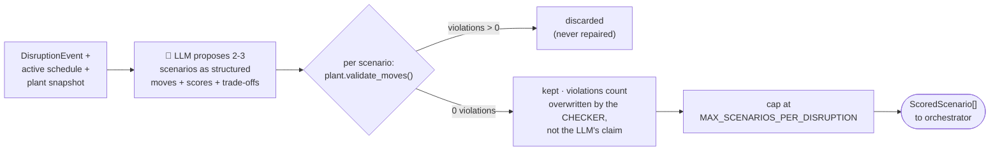

# `scenario-simulator` — agent card (placeholder)

**Status:** ✅ implemented — `agent.yaml` + `instructions.md` + `schemas.py` + `agent.py`
(Foundry Agent in live mode, recorded fixtures in replay mode). Every proposed scenario is
re-validated by the deterministic feasibility checker in `backend/plant.py`; infeasible
proposals are discarded, never repaired. All 4 golden eval cases pass.

## Job

The what-if engine. Given a disruption and the current schedule, it generates alternative
schedules, has each one validated by a **deterministic constraint solver**, and scores the
survivors on the soft-constraint trade-offs a human planner weighs: changeover cost vs.
order urgency, labor balancing, energy windows, downstream congestion.

## Contract

| | |
|---|---|
| **Model** | `gpt-5.4` (reasoning) — this agent does the heavy trade-off analysis |
| **Input** | `DisruptionEvent` + current `Schedule` |
| **Output** | `ScoredScenario[]` (max `MAX_SCENARIOS_PER_DISRUPTION`) — each `{ schedule_delta, hard_constraint_violations: 0, scores: { changeover_cost, urgency_served, labor_balance, energy }, tradeoff_summary }` |
| **Tools** | `solve_schedule` (function, constraint solver — e.g. OR-Tools CP-SAT) · `get_changeover_matrix` (function) · `get_order_book` (function, mock ERP) |

## Behavior rules

- **Division of labor:** the LLM frames scenarios and explains trade-offs; `solve_schedule`
  does the feasibility math. A scenario the solver rejects is discarded, never "fixed" by
  the LLM.
- Example trade-off it must reason about: group similar orders
  to minimize setup time, or prioritize an urgent order despite extra changeovers —
  depending on real-time downstream congestion.
- `tradeoff_summary` is written for the planner: one short paragraph per scenario, no
  jargon, states what is gained and what is given up.

## Flow

The deterministic checks behind `validate_moves()`: machine exists & is
tool-compatible with the product, down/maintenance machines can't start before
`available_from_hour`, delayed material can't be consumed before its ETA, and
no two orders may overlap on one machine (against untouched slots and against
the scenario's own moves).

## Eval cases that exercise this agent

`material_delay_tier1_tradeoff` (must present ≥ 2 scenarios) and both auto-reschedule
cases in [`../../evals/golden_dataset.json`](../../evals/golden_dataset.json).
