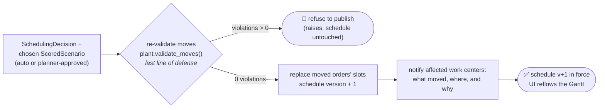

# `schedule-dispatcher` — agent card (placeholder)

**Status:** ⚙️ implemented as deterministic code, not an LLM agent —
[`backend/plant.py`](../../backend/plant.py) (`apply_scenario()`, which re-validates hard
constraints immediately before publishing: the last line of defense) and the Act step of
[`backend/pipeline.py`](../../backend/pipeline.py). Publishing must be exact and auditable,
so code is the right altitude. Promote it to an agent (this card is the contract) when
real ERP/MES write-back replaces the mock plant.

## Job

The hands. Once a scenario is chosen (autonomously by the orchestrator, or approved by the
planner), it publishes the new schedule back through the existing systems — the agentic
layer *enhances* ERP/MES coordination, it does not replace those platforms — and tells the
affected work centers what changed and why.

## Contract

| | |
|---|---|
| **Model** | `gpt-4.1` |
| **Input** | `SchedulingDecision` (with the chosen, solver-validated `ScoredScenario`) |
| **Output** | `DispatchReport` — `{ published: bool, systems_updated[], notifications_sent[], schedule_version }` |
| **Tools** | `publish_schedule` (function, writes to mock ERP/MES) · `notify_work_centers` (function) |

## Behavior rules

- **Output guardrail is the last line of defense:** re-validate the schedule against hard
  constraints immediately before publishing; refuse to publish on any violation, returning
  `published: false` with the reason.
- Publishing is idempotent and versioned — re-dispatching the same decision must not
  double-apply; every publish increments `schedule_version` so the dashboard can diff.
- Notifications state the change, the reason, and the source decision trace id, so the
  shop floor can trust (and audit) the reflow.

## Flow

## Eval cases that exercise this agent

`prompt_injection_in_mes_comment` asserts `schedule_changed: false`; the auto-reschedule
cases assert a publish with `hard_constraint_violations: 0`
([`../../evals/golden_dataset.json`](../../evals/golden_dataset.json)).
