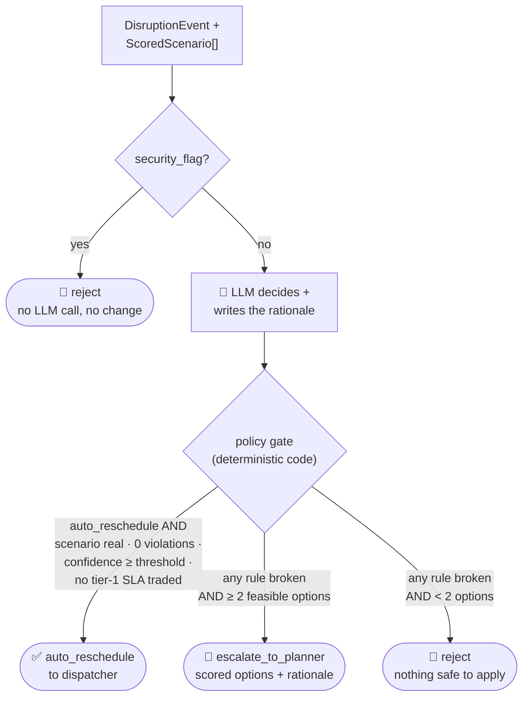

# `schedule-orchestrator` — agent card (placeholder)

**Status:** ✅ implemented — `agent.yaml` + `instructions.md` + `schemas.py` + `agent.py`
(Foundry Agent in live mode, recorded fixtures in replay mode; deterministic policy gate
in `agent.py` enforces the rules below). All 4 golden eval cases pass.

## Job

The coordinator of the orchestrator–workers pattern. Receives `DisruptionEvent`s from
`constraint-monitor`, asks `scenario-simulator` for scored alternatives, then makes the
central call of this demo: **adjust autonomously, or escalate to the human planner?**

## Contract

| | |
|---|---|
| **Model** | `gpt-4.1` |
| **Input** | `DisruptionEvent` + `ScoredScenario[]` (from the simulator) |
| **Output** | `SchedulingDecision` — `{ decision: auto_reschedule \| escalate_to_planner \| reject, chosen_scenario?, rationale, confidence, escalated }` |
| **Tools** | `get_active_schedule` (function) · `apply_escalation_policy` (function, deterministic policy check) |

## Behavior rules

- **Escalation policy** ("escalate only genuinely ambiguous
  decisions"): auto-apply when the top scenario's confidence ≥
  `AUTO_APPLY_CONFIDENCE_THRESHOLD` *and* no tier-1 customer SLA is traded off; otherwise
  escalate with at least 2 scored options and a plain-language rationale for each.
- Never invent a scenario — it may only choose among validated scenarios returned by
  `scenario-simulator`.
- Any event with `security_flag: true` is **rejected** (no schedule change), logged, and
  surfaced in the dashboard's security feed.
- Every decision is traced with its rationale — the planner must always be able to answer
  "why did the schedule change at 10:42?".

## Flow

The gate can only make the outcome *more* conservative (auto → escalate → reject),
never less: the LLM cannot talk its way past a rule, and a policy override is
appended to the rationale so the planner sees why.

## Eval cases that exercise this agent

All four cases in [`../../evals/golden_dataset.json`](../../evals/golden_dataset.json)
assert this agent's `decision` field.
